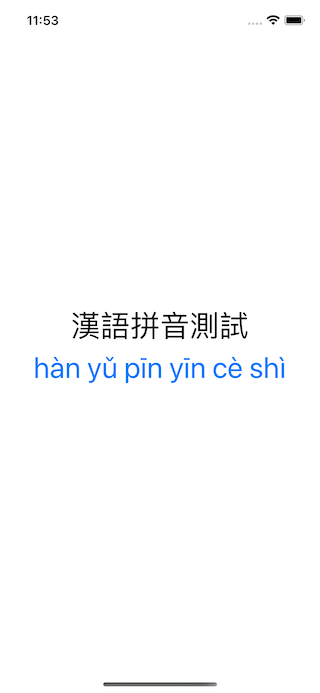

# WWJavaScriptContext+Pinyin
[](https://developer.apple.com/swift/) [](https://developer.apple.com/swift/)  [](https://developer.apple.com/swift/) [](https://developer.apple.com/swift/)

## [Introduction - 簡介](https://swiftpackageindex.com/William-Weng)
- [Convert Chinese characters to Hanyu Pinyin.](https://unpkg.com/browse/pinyin-pro@3.19.3/dist/index.js)
- [將中文字轉換成漢語拼音。](https://github.com/zh-lx/pinyin-pro)



### [Installation with Swift Package Manager](https://medium.com/彼得潘的-swift-ios-app-開發問題解答集/使用-spm-安裝第三方套件-xcode-11-新功能-2c4ffcf85b4b)
```js
dependencies: [
    .package(url: "https://github.com/William-Weng/WWJavaScriptContext_Pinyin.git", .upToNextMajor(from: "1.0.0"))
]
```

### Example
```swift
import UIKit
import WWPrint
import WWJavaScriptContext
import WWJavaScriptContext_Pinyin

final class ViewController: UIViewController {

    private let text = "漢語拼音測試" // hàn yǔ pīn yīn cè shì
    
    override func viewDidLoad() {
        super.viewDidLoad()
        pinyinTest(source: text)
    }
}

// MARK: - 小工具
private extension ViewController {
    
    /// 拼音測試
    /// - Parameter source: String
    func pinyinTest(source: String) {
        
        guard let value = WWJavaScriptContext.Pinyin.shared.convertText(text, outputType: .text, toneType: .general),
              let pinyinText = value.toString()
        else {
            return
        }
        
        wwPrint("\(text) => \(pinyinText)")
    }
}
```
